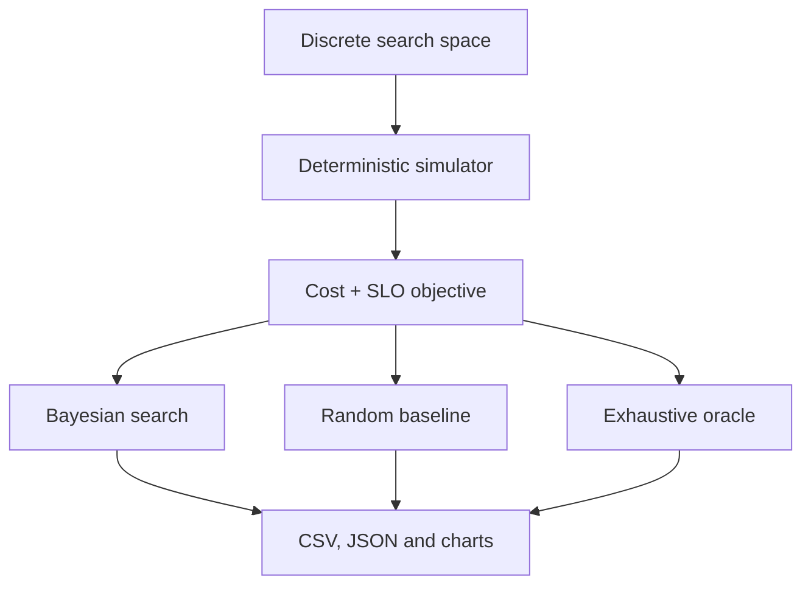

# Big Data Workload Optimisation

[](https://github.com/tomaszkaczma/Big-Data-Coursework/actions/workflows/ci.yml)
[](https://www.python.org/)
[](LICENSE)

A reproducible experiment for selecting cost-efficient workload configurations
under throughput and latency constraints. The project uses Gaussian-process
Bayesian optimisation to search worker count, batch size, and storage strategy,
then checks the result against random search and an exhaustive oracle.

This repository is a portfolio-focused rebuild of my university Big Data
coursework. The original report is preserved in
[`Tomasz Kaczmarski BD CW2.pdf`](Tomasz%20Kaczmarski%20BD%20CW2.pdf), while
the new implementation, assumptions, tests, and generated evidence are fully
reproducible.

## Baseline result

Using the documented synthetic model, seed `42`, and a budget of 12 evaluations
from a 60-configuration search space:

| Method | Best feasible configuration | Cost units / 1M records | Difference from oracle |
|---|---|---:|---:|
| Exhaustive oracle | 4 workers, batch 64, batched records | 0.132570 | 0.00% |
| Bayesian search | 4 workers, batch 128, batched records | 0.134765 | +1.66% |
| Random search | 4 workers, batch 64, compressed batches | 0.144863 | +9.27% |

The service-level objective was at least 900 records/second and no more than
45 ms synthetic p95 latency. These values are deterministic simulation outputs,
not measurements or prices from a cloud provider.


## Why this project exists

Cloud analytics jobs can have many valid infrastructure and ingestion
configurations. Testing all of them may be expensive, but selecting a poor
configuration can increase both runtime and cost. This project demonstrates a
small, auditable decision workflow:

1. define the candidate configurations and service-level objective;
2. evaluate a small, seeded initial design;
3. fit a Gaussian-process surrogate model;
4. select the next candidate with expected improvement;
5. compare the recommendation with random search;
6. verify both methods against the exhaustive optimum.

The approach is inspired by
[CherryPick](https://www.usenix.org/conference/nsdi17/technical-sessions/presentation/alipourfard),
which applies Bayesian optimisation to cloud configuration selection.

## Architecture



## Quick start

```bash
git clone https://github.com/tomaszkaczma/Big-Data-Coursework.git
cd Big-Data-Coursework

python -m venv .venv
source .venv/bin/activate  # Windows: .venv\Scripts\activate
python -m pip install --upgrade pip
python -m pip install -e .

cloud-workload-optimizer --output results
```

Equivalent module command:

```bash
python -m cloud_workload_optimizer --output results
```

Customise the optimisation problem:

```bash
cloud-workload-optimizer \
  --budget 18 \
  --minimum-throughput 950 \
  --maximum-p95-latency-ms 40 \
  --cost-units-per-worker-hour 0.12 \
  --seed 42 \
  --output results/custom-run
```

## Search space and objective

The default search space contains `4 × 5 × 3 = 60` candidates:

- workers: `1, 2, 4, 8`;
- batch size: `16, 32, 64, 128, 256`;
- storage strategy: individual files, batched records, compressed batches.

Each candidate produces throughput, p95 latency, duration, estimated cost, cost
per million records, feasibility, and a scalar constrained objective. The model
includes diminishing worker returns, a nonlinear batch-size effect, strategy
overheads, and deterministic seeded variation.

The optimiser uses:

- log-scaled numeric features for workers and batch size;
- one-hot encoding for storage strategy;
- a Matérn 5/2 Gaussian-process kernel;
- expected improvement for sequential candidate selection;
- explicit penalties for throughput shortfall and latency excess.

See [`docs/METHODOLOGY.md`](docs/METHODOLOGY.md) for the equations, assumptions,
and interpretation rules.

## Generated evidence

Running the default command creates:

| File | Purpose |
|---|---|
| `results/all_configurations.csv` | all 60 oracle evaluations |
| `results/bayesian_trace.csv` | Bayesian candidates and incumbent by step |
| `results/random_trace.csv` | seeded random-search baseline |
| `results/summary.json` | machine-readable settings and headline results |
| `results/cost_performance.svg` | full cost/throughput landscape |
| `results/optimisation_trace.svg` | best feasible cost by evaluation |

## Project structure

```text
.
├── src/cloud_workload_optimizer/
│   ├── config.py          # typed configurations, SLO and search space
│   ├── simulator.py       # deterministic performance and cost model
│   ├── optimizer.py       # Bayesian, random and exhaustive search
│   ├── reporting.py       # CSV, JSON and visual outputs
│   ├── experiment.py      # end-to-end orchestration
│   └── cli.py             # command-line interface
├── tests/                 # unit and end-to-end contract tests
├── results/               # committed reproducible baseline
├── docs/                  # methodology, provenance and report audit
├── Tomasz Kaczmarski BD CW2.pdf  # unchanged original report
├── .github/workflows/     # CI on Python 3.10–3.12
└── pyproject.toml         # packaging, dependencies and tool configuration
```

## Quality checks

```bash
python -m pip install -e ".[dev]"
ruff check .
mypy src
python -m unittest discover -s tests -v
python -m build
```

Continuous integration runs these checks on Python 3.10, 3.11, and 3.12.

## Interpretation and limitations

This rebuild intentionally does not recreate unavailable measurements from the
original coursework. The source dataset, notebook, cloud configuration details,
raw timings, and pricing snapshot were not present in the repository.

The current simulator is useful for testing optimisation logic and comparing
search strategies under controlled conditions. It is not evidence that a
specific cloud setup will achieve the reported throughput, latency, or cost.
A real deployment should replace `WorkloadSimulator.evaluate` with a benchmark
adapter and record provider, region, machine type, software versions, workload
hash, repetitions, uncertainty, timestamp, and pricing source.

Read [`docs/PROVENANCE.md`](docs/PROVENANCE.md) for a precise separation between
the 2020 coursework and the 2026 rebuild.

## References

- Alipourfard, O. et al. (2017).
  [*CherryPick: Adaptively Unearthing the Best Cloud Configurations for Big Data Analytics*](https://www.usenix.org/conference/nsdi17/technical-sessions/presentation/alipourfard).
  14th USENIX Symposium on Networked Systems Design and Implementation.
- [scikit-learn Gaussian processes documentation](https://scikit-learn.org/stable/modules/gaussian_process.html).

## Licence

Code in this rebuild is available under the [MIT License](LICENSE). The
archived coursework report is retained as the author's original academic work.
